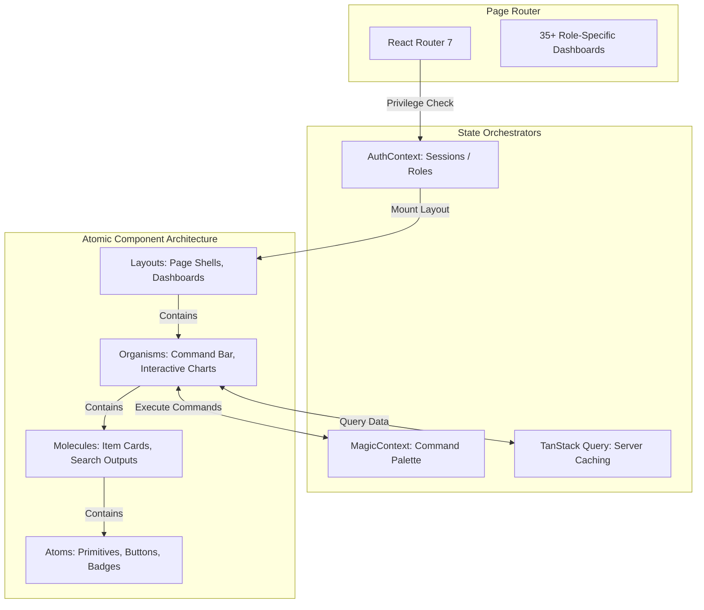

# NexaSetu Frontend SPA — Role-Adaptive Sprint Management Interface

This is the client-side Single Page Application (SPA) for **NexaSetu**. It is a developer-first interface designed to display GitHub activity, sprint metrics, and dependency graphs without administrative bloat.

---

## 🛠️ Tech Stack

- **Framework:** React 19 (Hooks, Context, Memoization)
- **Build Tool:** Vite (Hot Module Replacement, Code-splitting)
- **Styling:** Tailwind CSS 4 (Modern variables, utility-first)
- **State & Data Caching:** TanStack React Query v5 (Server-state synchronization)
- **Client-Side Routing:** React Router 7 (Protected, metadata-driven routes)
- **Real-Time Layer:** Socket.io-client (Bidirectional state synchronization)
- **Data Visualizations:** ReactFlow (Interactive dependency graphs) & Recharts (Sprint analytics)

---

## 🏗️ Frontend Architecture & State Flow

NexaSetu organizes visual components and state hooks into a clean, maintainable structure:



---

## 📂 Project Organization

```text
src/
├── api/                # Axios network configurations & route endpoints
├── components/         # Atomic design system implementation
│   ├── atoms/          # Primitive UI blocks (semantic buttons, inputs, status badges)
│   ├── molecules/      # Combined components (sprint stats cards, workload items)
│   ├── organisms/      # Complex modules (floating MagicBar command palette, ReactFlow pane)
│   └── layouts/        # Page container shells (Global Navigation, Dashboard shells)
├── context/            # Global React Context providers (AuthContext, MagicContext)
├── hooks/              # Custom UI hooks (useTasks, useBilling, useAdminDashboard)
├── pages/              # 35+ specialized dashboard pages based on team roles
├── routes/             # Protected routing rules and privilege middleware
├── services/           # Socket.io listeners and live message channels
└── index.css           # Modern color variables, theme variables, and Tailwind directives
```

---

## ⚡ Frontend Engineering Challenges Solved

### 1. Unified State Across 35+ Role-Specific Dashboards
Managing data consistency across numerous role views (e.g. CTO, Intern, Tech Lead) without duplicate API calls or stale caches is highly complex.
- **Solution:** Designed shared custom hooks backed by **TanStack Query**. Custom query hooks share identical cache keys (`['sprints', projectId]`), allowing separate dashboard modules to utilize cached values concurrently.

### 2. High-Density Graph Rendering Performance (ReactFlow)
Rendering complex dependency trees with 100+ tasks can cause layout latency and stuttering frame rates.
- **Solution:** Configured ReactFlow nodes to only re-render when their coordinate metrics change by utilizing shallow props comparisons. We also offload expensive layout math (calculating topological node placements) to a memoized computation step.

### 3. Safe WebSocket State Synchronization
Handling incoming live event streams (Socket.io) directly within React render lifecycles can lead to state memory leaks, race conditions, or duplicate event listeners.
- **Solution:** Encapsulated WebSocket management within dedicated React `useEffect` cleanups:
  ```javascript
  useEffect(() => {
    socket.connect();
    socket.on('task_updated', handleTaskUpdate);
    
    return () => {
      socket.off('task_updated', handleTaskUpdate);
      socket.disconnect();
    };
  }, [projectId]);
  ```

---

## 📈 Performance Benchmarks

- **Route-Level Code Splitting:** Dynamically bundles route views into chunk files, keeping the initial JS payload below `~66kB`.
- **WebSocket Throttling:** Live feed streams buffer incoming events, refreshing the UI state in batch cycles every `250ms` rather than triggering individual component updates for every commit.
- **Memoized Metrics Rendering:** Recharts and ReactFlow modules utilize custom memoization keys to eliminate calculations during background sidebar drawer updates.

---

## ⚙️ Local Setup

1. Clone repository and navigate to frontend directory:
   ```bash
   cd NexaSetu-frontend
   ```
2. Install project packages:
   ```bash
   npm install
   ```
3. Create a `.env` file in the root directory:
   ```env
   VITE_API_URL=http://localhost:5000/api
   VITE_SOCKET_URL=http://localhost:5000
   ```
4. Start the Vite hot-reloading development server:
   ```bash
   npm run dev
   ```
